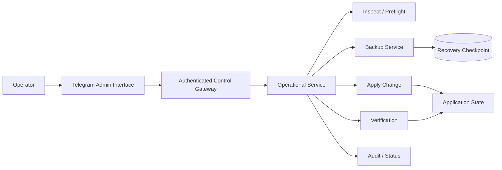
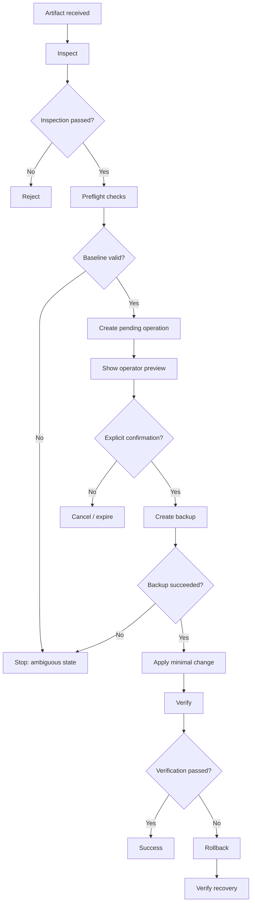
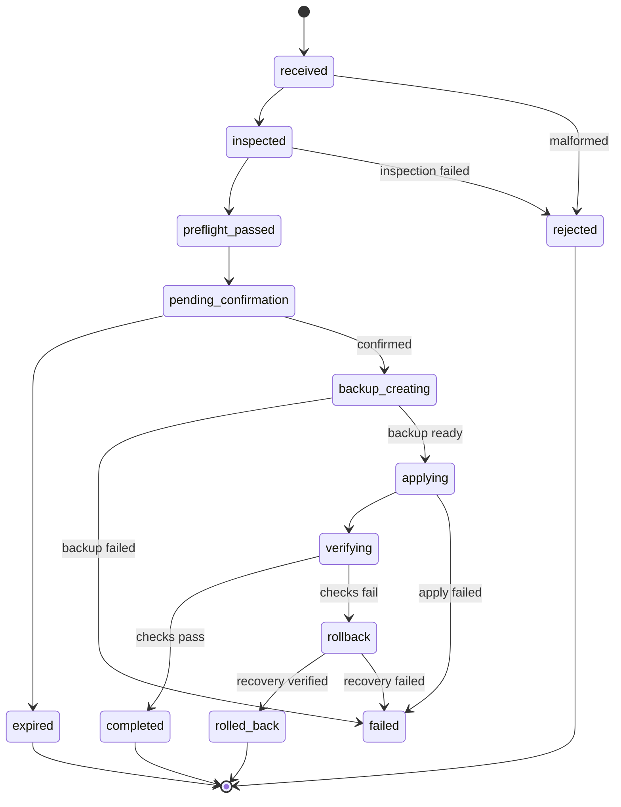
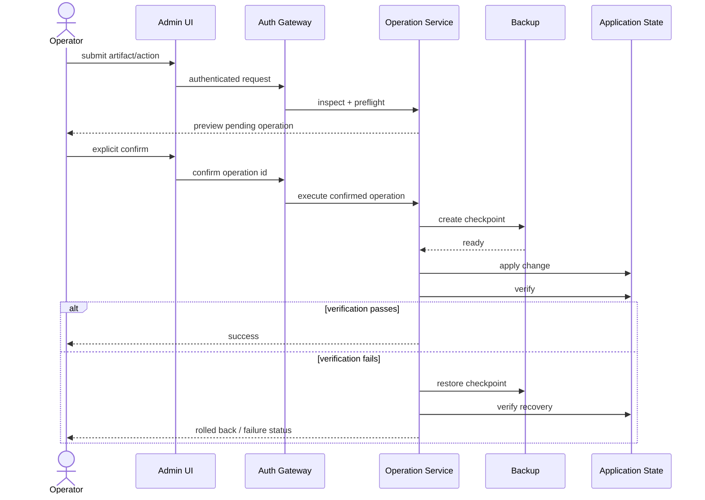
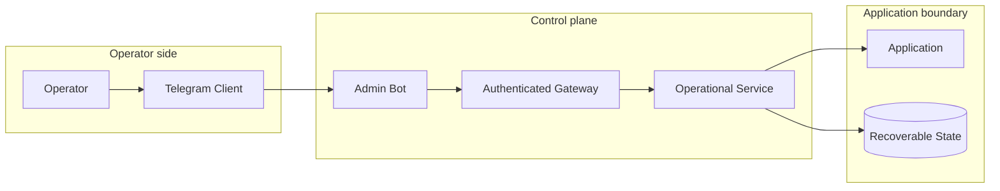
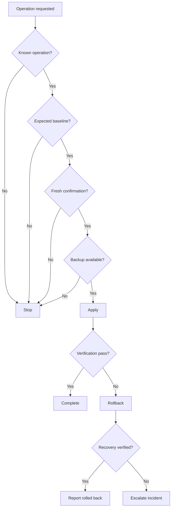
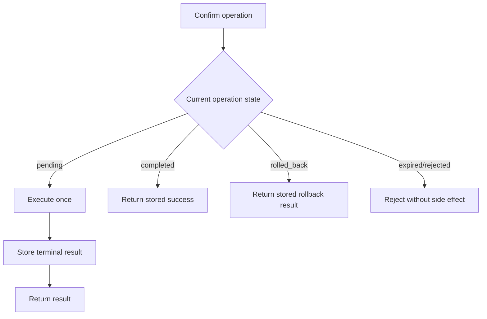

# BullADM diagrams

Public-safe diagrams for the operational control plane. They deliberately omit real credentials, hostnames, addresses, privileged paths and private endpoints.

## 1. Control-plane context

Telegram is an operator interface, not an unrestricted shell.

## 2. Deployment workflow

## 3. Operation state machine

## 4. Confirmation sequence

## 5. Trust boundaries

The security idea is narrow authority: the chat interface can request known operations, but it does not expose generic privileged command execution.

## 6. Failure decision tree

## 7. Idempotent retry flow

## Interview talking points

- Why an admin bot should not become a remote shell.
- Why confirmation and execution are separate operations.
- Why baseline validation prevents applying a valid artifact to the wrong state.
- Why backup creation is a hard precondition rather than a best-effort step.
- How state machines make operational behaviour auditable.
- How fail-closed design changes error handling for privileged workflows.
