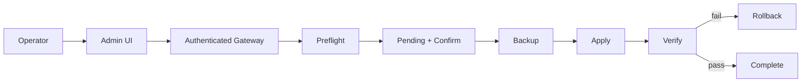

# BullADM interview guide

## 30-second version

BullADM is an operational-automation case focused on making privileged changes safer from a mobile interface. Telegram is only the adapter; the core workflow is `inspect -> preflight -> confirm -> backup -> apply -> verify -> rollback`. I modelled it with requirements, business rules, state/sequence diagrams, an operation contract, risk/threat analysis, tests and traceability. The main design principle is that a chat bot must never become an unrestricted remote shell.

## 2-minute walkthrough

1. The operator requests a **known operation**.
2. Inspection and preflight validate artifact and expected baseline.
3. The system creates a pending operation and shows an exact preview.
4. Fresh explicit confirmation authorizes that stored operation.
5. A recovery checkpoint must succeed before mutation starts.
6. The system applies the smallest expected change and verifies outcome.
7. Failed verification enters rollback; rollback itself is verified.

## Questions I should be ready to answer

### Why not just SSH?

SSH is useful, but ad-hoc manual operations have weaker repeatability, preview, audit and rollback guarantees. BullADM narrows frequent operations into a controlled workflow.

### Why separate preflight from verification?

Preflight asks **"is it safe to attempt this change on the current baseline?"**. Verification asks **"did the change actually produce the required result?"**. They protect different failure modes.

### Why must backup be a hard precondition?

If rollback is part of the recovery design, starting a change without a usable recovery point creates an avoidable unknown-risk state.

### What makes confirmation stale?

Time expiry or a domain/baseline change that invalidates assumptions used when the preview was created. Execution must re-validate current state.

### Where does idempotency matter?

At confirmation/execution boundaries where clients may retry after timeouts. Repeating the same logical operation must not repeat the business effect.

### Why is Telegram not the security boundary?

A UI/session is not enough. The control service must authenticate/authorize requests and constrain them to known operation contracts regardless of client.

## Files worth opening

- `README.md` — overview;
- `DIAGRAMS.md` — workflow, state and sequence models;
- `RISK_REGISTER.md` — operational failure analysis;
- `THREAT_MODEL.md` — trust boundaries and privileged-operation threats;
- `OPERATION_CONTRACT.md` — state/error contract;
- `TEST_SCENARIOS.md` — verification;
- `TRACEABILITY.md` — requirement-to-test trail;
- `DECISIONS.md` — design trade-offs.
