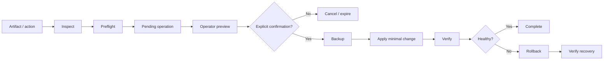
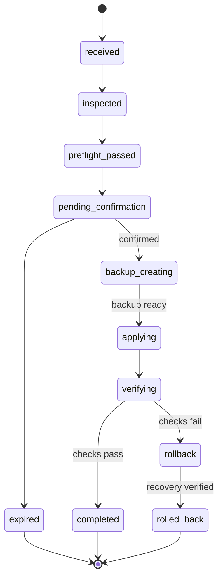

# BullADM — safe operations from a mobile control plane

BullADM is an operational-automation case study about making privileged changes safer when the operator is away from a workstation.

The Telegram interface is only the front door. The engineering problem is the workflow behind it:

`inspect -> preflight -> explicit confirmation -> backup -> apply -> verify -> rollback if needed`

The public repository intentionally contains **architecture and analysis artifacts only**. It does not publish credentials, real infrastructure, privileged endpoints, production paths, backups, logs or code that would expose administrative access.

## What this portfolio demonstrates

- operational workflow analysis;
- system/control-plane boundaries;
- explicit state machines;
- confirmation-gated mutations;
- fail-closed behaviour;
- backup and rollback as normal workflow stages;
- idempotency and stale-operation handling;
- trust boundaries and least authority;
- test scenarios for privileged operations;
- mobile-first operator UX.

## Core workflow

## Analyst package

| Artifact | Purpose |
|---|---|
| [CASE_STUDY.md](CASE_STUDY.md) | problem, constraints and engineering decisions |
| [REQUIREMENTS.md](REQUIREMENTS.md) | functional/non-functional requirements and acceptance criteria |
| [BUSINESS_RULES.md](BUSINESS_RULES.md) | operational invariants and fail-closed rules |
| [DIAGRAMS.md](DIAGRAMS.md) | context, workflow, state machine, sequence and trust-boundary diagrams |
| [OPERATION_CONTRACT.md](OPERATION_CONTRACT.md) | public-safe request/state/error contract |
| [TEST_SCENARIOS.md](TEST_SCENARIOS.md) | system-level verification scenarios |
| [TRACEABILITY.md](TRACEABILITY.md) | requirement -> workflow -> contract -> test mapping |
| [SECURITY_BOUNDARY.md](SECURITY_BOUNDARY.md) | what the public case deliberately does and does not expose |

## Main design idea

A chat bot must not become a remote shell.

The operator can request a **known operation**, inspect the exact planned change and explicitly authorize it. Execution then passes through preconditions, backup and verification. If the current state is ambiguous, the operation stops instead of guessing.

## Operation states

## Interview discussion

This case can be used to discuss:

- why confirmation and execution should be separate operations;
- why backup creation is a hard precondition;
- what makes an operation stale;
- where idempotency belongs;
- why a valid artifact may still be unsafe for the current baseline;
- how to model recovery as part of the happy-path design;
- why Telegram is an adapter rather than the source of business rules.

## Public-safety note

Names and diagrams are intentionally generic. Real infrastructure details are omitted so the repository can demonstrate system-analysis and operational-safety thinking without publishing privileged implementation details.
