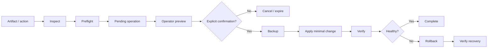
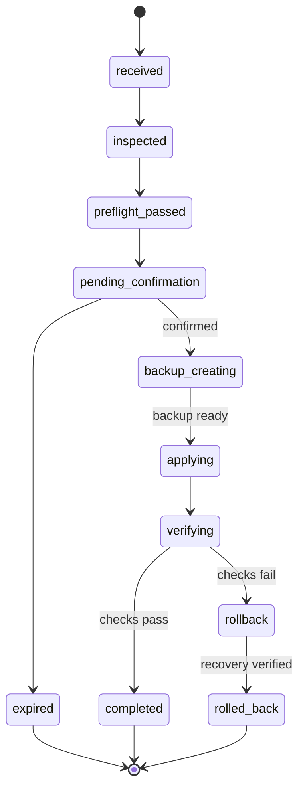

# BullADM — safe operations from a mobile control plane

**Operational automation · System analysis · State modelling · Risk & failure analysis**

BullADM is an operational-automation case study about making privileged changes safer when the operator is away from a workstation.

`inspect -> preflight -> explicit confirmation -> backup -> apply -> verify -> rollback`

The Telegram interface is only the front door. The engineering problem is the controlled workflow behind it.

> Interviewer/recruiter: [`INTERVIEW_GUIDE.md`](INTERVIEW_GUIDE.md) gives the 30-second and 2-minute walkthrough.

## Core workflow

## Analyst package

| Artifact | Purpose |
|---|---|
| [CASE_STUDY.md](CASE_STUDY.md) | problem, constraints and engineering context |
| [REQUIREMENTS.md](REQUIREMENTS.md) | functional/non-functional requirements and acceptance criteria |
| [BUSINESS_RULES.md](BUSINESS_RULES.md) | operational invariants and fail-closed rules |
| [DIAGRAMS.md](DIAGRAMS.md) | context, workflow, state machine, sequence and trust-boundary diagrams |
| [OPERATION_CONTRACT.md](OPERATION_CONTRACT.md) | public-safe request/state/error contract |
| [RISK_REGISTER.md](RISK_REGISTER.md) | risks, impact, controls and verification evidence |
| [THREAT_MODEL.md](THREAT_MODEL.md) | assets, trust boundaries and privileged-operation threats |
| [TEST_SCENARIOS.md](TEST_SCENARIOS.md) | system-level verification scenarios |
| [TRACEABILITY.md](TRACEABILITY.md) | requirement -> workflow -> contract -> test mapping |
| [DECISIONS.md](DECISIONS.md) | ADR-style design choices and trade-offs |
| [SECURITY_BOUNDARY.md](SECURITY_BOUNDARY.md) | what the public case deliberately does and does not expose |
| [INTERVIEW_GUIDE.md](INTERVIEW_GUIDE.md) | concise interview walkthrough and likely questions |

## Main design idea

A chat bot must **not** become a remote shell.

The operator can request a **known operation**, inspect the exact planned change and explicitly authorize it. Execution then passes through preconditions, backup and verification. If current state is ambiguous, the operation stops instead of guessing.

## Operation states

## What this demonstrates

- operational workflow decomposition;
- explicit state modelling;
- confirmation-gated mutations;
- baseline validation and stale-state handling;
- idempotency at retry boundaries;
- backup/rollback as normal workflow stages;
- risk analysis and threat modelling;
- trust boundaries / least authority;
- failure and recovery verification;
- requirements-to-test traceability;
- CI checks for the public-safe portfolio boundary.

## Public-safety boundary

This repository contains **architecture and analysis artifacts only**. It intentionally does not publish credentials, real infrastructure, privileged endpoints, production paths, backups, logs or code that would expose administrative access.
