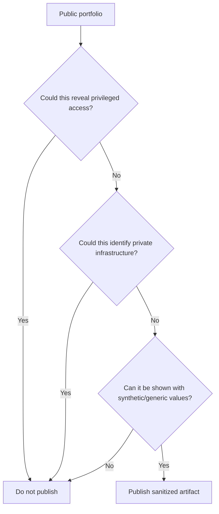

# BullADM — public security boundary

This repository is a portfolio artifact, not an administrative client and not a copy of production infrastructure.

## Publicly documented

The repository may describe:

- generic control-plane architecture;
- operation state machines;
- confirmation/preflight/backup/verification concepts;
- synthetic request/response examples;
- test scenarios;
- fail-closed and idempotency rules;
- generic trust boundaries.

## Intentionally not published

The repository must not include:

- bot tokens, API keys or passwords;
- cryptographic/HMAC secrets;
- real hostnames, domains, IP addresses or ports;
- provider/account identifiers;
- production absolute filesystem paths;
- real privileged endpoints;
- SSH configuration/keys;
- production backup contents;
- logs containing user/system identifiers;
- production patch archives or internal deployment payloads;
- implementation code that would expose privileged command execution;
- real authentication headers or signed request examples.

## Threat-oriented view

## Security design ideas shown safely

### Narrow authority
The admin interface requests known business/operational actions instead of arbitrary commands.

### Confirmation is not authentication
Authentication answers **who/what may request** an operation. Confirmation answers **whether this exact prepared change is now authorized**. Both can be required.

### Baseline validation
A well-formed change can still be unsafe for the current target state. Preflight therefore validates expected state separately from artifact syntax.

### Recovery before mutation
The existence and validity of a recovery path is established before apply begins.

### Secret minimization
Operator previews and routine status messages should describe action scope and state without embedding authentication secrets.

## Publication rule

When in doubt, preserve the engineering idea and remove the operational identifier/detail.

The portfolio should help an interviewer understand the safety model, not help an outsider reconstruct a privileged production interface.
