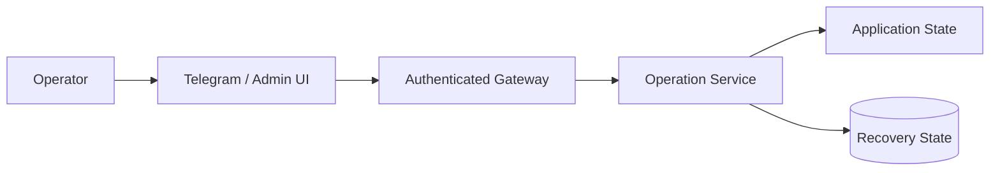

# BullADM threat model

This is a conceptual, public-safe threat model for an operational control plane. It intentionally excludes real endpoints, credentials, hostnames, paths and implementation secrets.

## Assets to protect

- production application state;
- integrity of deployment artifacts;
- operator authorization context;
- recovery checkpoints;
- audit/status evidence;
- privileged operation capability.

## Trust boundaries

The important point is that crossing from UI to control plane does not grant generic command execution. Requests remain constrained to known operations.

## Threats and design responses

### T-01 — forged or unauthenticated control request

**Risk:** an external actor invokes privileged workflow actions.

**Design response:** authenticated control gateway, narrow request contract, authorization before operation creation.

### T-02 — replayed confirmation

**Risk:** an old confirmation is delivered again.

**Design response:** operation IDs, explicit states, expiry and idempotent terminal handling.

### T-03 — parameter substitution during confirmation

**Risk:** preview shows one target while confirmation silently changes another.

**Design response:** confirmation references the stored operation; it does not accept replacement mutation parameters.

### T-04 — baseline confusion

**Risk:** the artifact/action is valid but the current application state is not the state it was designed for.

**Design response:** preflight baseline validation immediately before mutation.

### T-05 — partial apply / unknown outcome

**Risk:** mutation starts but transport/process failure makes the result ambiguous.

**Design response:** explicit operation state, post-apply verification, idempotent recovery handling and rollback where safe.

### T-06 — recovery data unavailable

**Risk:** rollback is required but the checkpoint is missing or invalid.

**Design response:** backup creation and validation are hard preconditions before apply.

### T-07 — privileged implementation leakage

**Risk:** public portfolio or logs reveal sensitive operational details.

**Design response:** sanitized public repository, no production code/paths/secrets, automated pattern checks.

## Security properties

The public design aims for:

- **least authority** — UI requests known operations, not arbitrary shell commands;
- **explicit authorization** — mutation requires a fresh confirmation;
- **integrity** — stored operation parameters are authoritative;
- **fail closed** — ambiguous state stops the workflow;
- **recoverability** — rollback is designed before apply;
- **auditability** — terminal outcome is explicit and reviewable.

This is not presented as a complete production security assessment; it is an analyst artifact showing how trust boundaries and privileged workflows can be reasoned about systematically.
